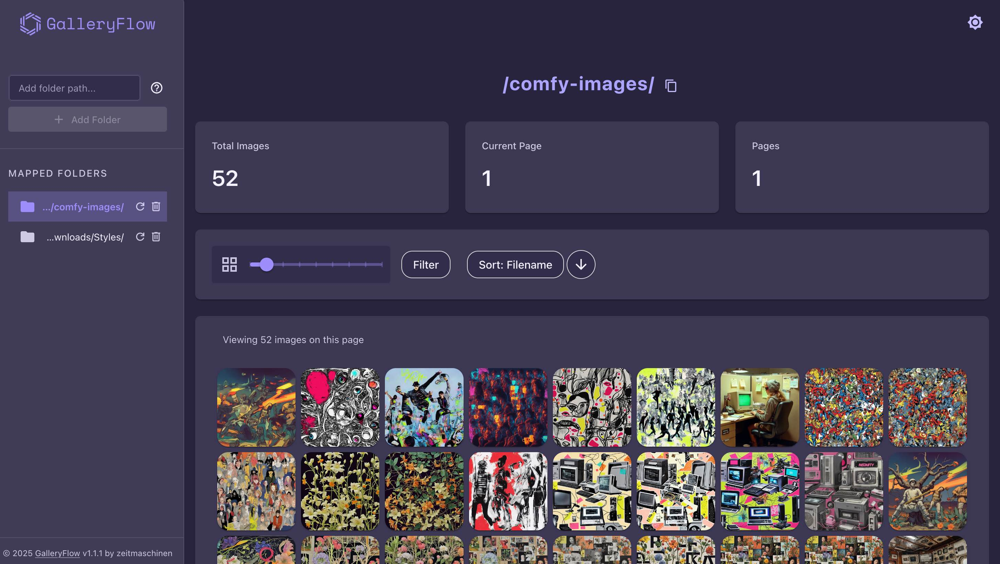
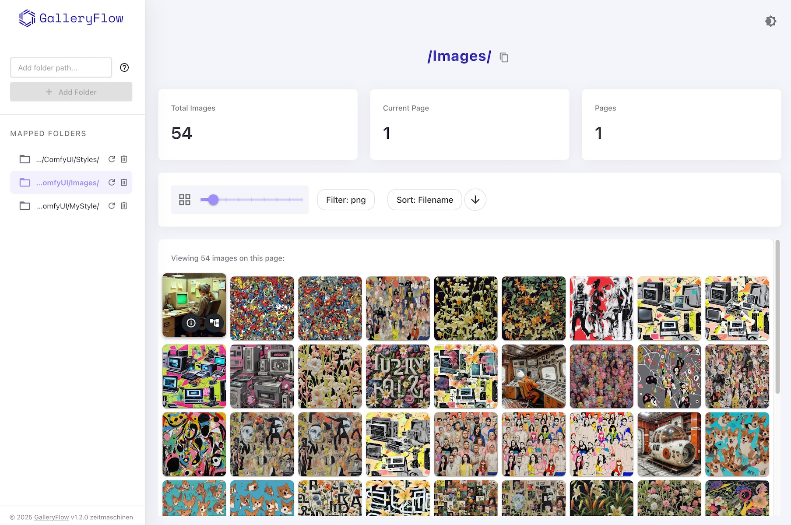
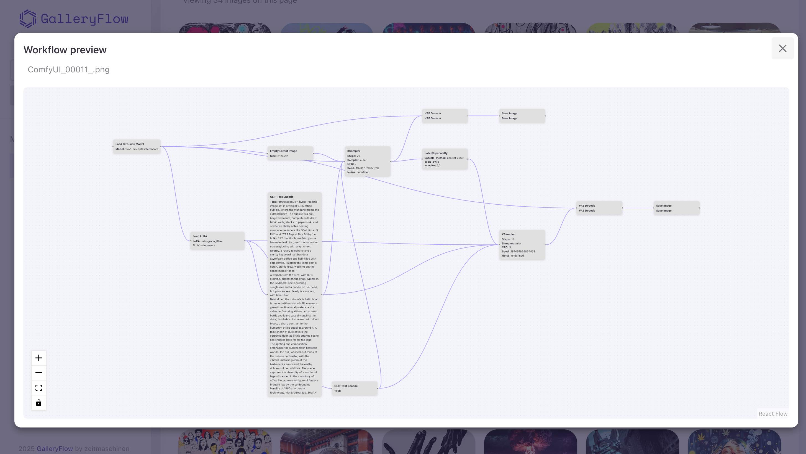

# GalleryFlow 1.4.0

A modern web application for browsing and managing <a href="https://github.com/comfyanonymous/ComfyUI" target="_blank" rel="noopener noreferrer">ComfyUI</a>-generated images with advanced metadata support.

Effortlessly connect to your ComfyUI output directory and instantly sort and filter your images, dive deep into advanced metadata extraction and visualize complete workflow nodes and their connections.

## Features

- 📁 Browse and manage your ComfyUI-generated images
- 🖼️ Customizable thumbnail sizes
- 🎨 Image preview
- 📋 Metadata extraction and visualization
- 🧩 Workflow visualization for each image and copy JSON to clipboard
- 🚀 Automatic real-time gallery updates
- 📂 Recursively reads all folders, so you never miss an image
- 🔄 Real-time sorting and filtering options
- ⚡ Fast and responsive interface
- 🌓 Light/Dark theme support
- 🔗 Direct integration with ComfyUI workflows
- 🔄 WebSocket support for real-time updates

<br>



<br>



<br>


<br>



<br>

## Tech Stack
- **Frontend:** React 18, TypeScript, Material UI
- **Backend:** FastAPI, SQLAlchemy, Python 3.10+
- **Other:** WebSockets, React Flow, custom theming, responsive design

---

## Quick Start

### Prerequisites
- **Git**
- **Python 3.10+** (3.13 recommended)
- **Node.js** and **npm**

---

### 1. Clone the Repository

```bash
git clone git@github.com:zeitmaschinen/galleryflow.git
cd galleryflow
```

---

### 2. Install Backend Dependencies

```bash
cd backend
python3 -m venv venv         # or python -m venv venv on Windows
source venv/bin/activate     # or venv\Scripts\activate on Windows
pip install -r requirements.txt
cd ..  # Return to project root for next steps
```

---

### 3. Install Frontend (Node.js)

```bash
cd frontend
npm install
cd ..  # Return to project root
```

---

### 4. Start the Application (Every time you want to run the app)

On a terminal/command window **in the project root**, run:

```bash
source backend/venv/bin/activate     # or backend\venv\Scripts\activate on Windows
python3 run_galleryflow.py
```

- This will launch both the backend and frontend. 
- The backend will be available at [http://localhost:8000](http://localhost:8000).
- The frontend will be available at [http://localhost:5173](http://localhost:5173).

---

### Troubleshooting
If you're getting an error when installing npm, you likely need to install nodejs first.
Close your current terminal/command window, download and install Node.js from [nodejs.org](https://nodejs.org/), then open a new terminal and run `npm install` again.

---

### 5. To Open GalleryFlow

- Visit [http://localhost:5173](http://localhost:5173) in your browser.
- Add folder path from your ComfyUI images output.
- Enjoy! 🎉

---

### 6. Additional Notes

- Both the backend and frontend are started automatically by a python script for full functionality.

## Configuration
- See `.env.example` for available configuration options.

## Contributing
- For advanced usage, troubleshooting, SSH setup, and contributing, see [CONTRIBUTING.md](CONTRIBUTING.md).

## Contact
You can find me and follow my creations:
- [hyperink.lab](https://www.instagram.com/hyperink.lab)
- [stablevisi.on](https://www.instagram.com/stablevisi.on)

If this project is useful to you, please don't forget to give it a star! 🌟 🤗

## License
This project is licensed under the MIT License – see the [LICENSE](LICENSE) file for details.
