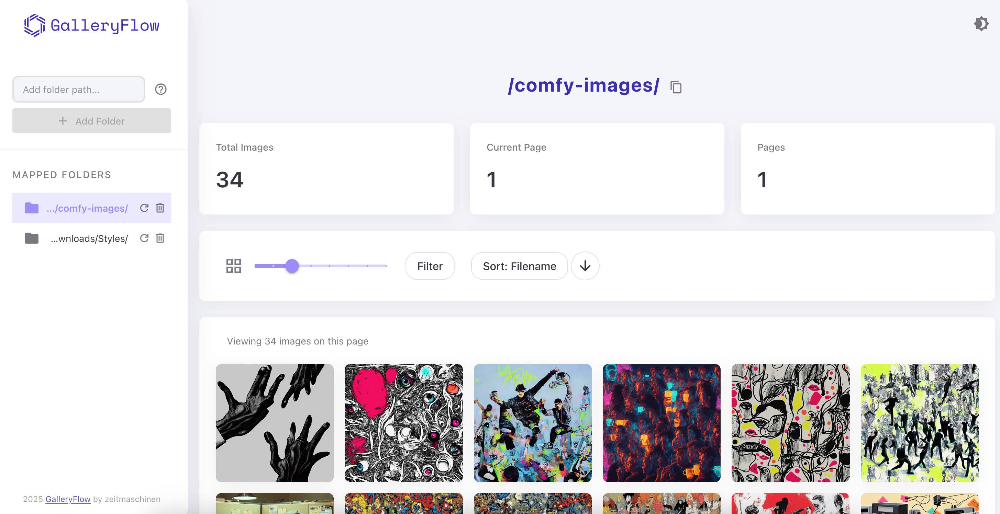
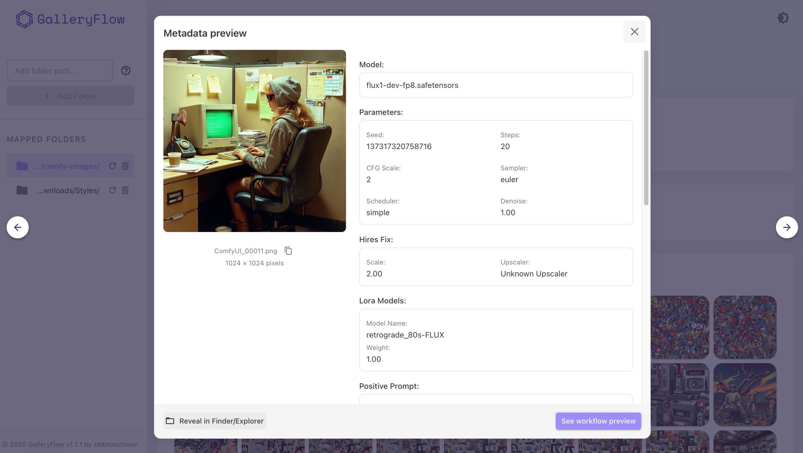

# GalleryFlow

A modern web application for browsing and managing <a href="https://github.com/comfyanonymous/ComfyUI" target="_blank" rel="noopener noreferrer">ComfyUI</a>-generated images with advanced metadata support.

You can connect to your ComfyUI output directory, customize sorting/filtering, set view preferences and configure metadata extraction.

## Features

- 📁 Browse and manage your ComfyUI-generated images
- 🖼️ Customizable thumbnail sizes
- 🎨 Image preview
- 📋 Metadata extraction and visualization
- 🚀 Automatic real-time gallery updates
- 📂 Recursively reads all folders, so you never miss an image
- 🔄 Real-time sorting and filtering options
- ⚡ Fast and responsive interface
- 🌓 Light/Dark theme support
- 🔗 Direct integration with ComfyUI workflows
- 🔄 WebSocket support for real-time updates




## Tech Stack
- **Frontend:** React 18, TypeScript, Material UI
- **Backend:** FastAPI, SQLAlchemy, Python 3.10+
- **Other:** WebSockets, custom theming, responsive design

---

## Quick Start

### Prerequisites
- **Git**
- **Python 3.10+** (3.13 recommended)
- **Node.js** and **npm**

---

### 1. Clone the Repository

```bash
git clone git@github.com:zeitmaschinen/galleryflow.git
cd galleryflow
```

---

### 2. Start the Backend

```bash
cd backend
python3 -m venv venv
source venv/bin/activate  # On Windows: venv\Scripts\activate
pip install -r requirements.txt
uvicorn app.main:app --reload --host 0.0.0.0 --port 8000
```

- The backend will be available at [http://localhost:8000](http://localhost:8000).
- **Automatic Updates:** As soon as you add or delete images in your monitored folders, the gallery will update in real time—no refresh required!

---

### 3. Start the Frontend

Open a new terminal and run:

```bash
cd frontend
npm install
npm run dev
```

- The frontend will be available at [http://localhost:5173](http://localhost:5173).

---

### 4. Open the App

- Visit [http://localhost:5173](http://localhost:5173) in your browser.
- Add folder path from your ComfyUI images output.

---

### 5. Additional Notes

- The backend and frontend must both be running for full functionality.

## Configuration
- See `.env.example` for available configuration options.

## Contributing
- For advanced usage, troubleshooting, SSH setup, and contributing, see [CONTRIBUTING.md](CONTRIBUTING.md).

## Contact
You can find me and follow my creations:
- [hyperink.ai](https://www.instagram.com/hyperink.ai)
- [latentvisi.on](https://www.instagram.com/latentvisi.on)
If this project is useful to you, please don't forget to give it a star! 🌟 🤗

## License
This project is licensed under the MIT License – see the [LICENSE](LICENSE) file for details.